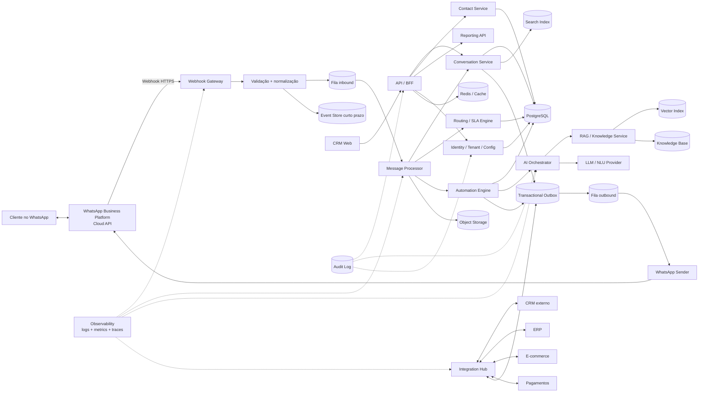
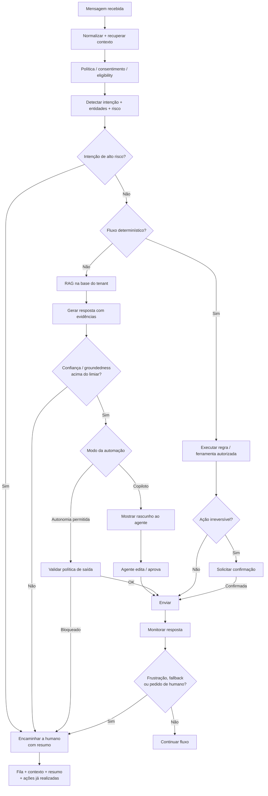

# CRM para WhatsApp: melhores práticas de produto, arquitetura, UX, IA, segurança e roadmap

## Resumo executivo

Para PMEs e equipes de atendimento, um bom CRM para WhatsApp não deve ser concebido como “uma tela para responder mensagens”, mas como uma **plataforma de operação conversacional** composta por cinco capacidades centrais: caixa de entrada compartilhada, visão unificada do cliente, automação controlada, integração com sistemas de negócio e governança. A WhatsApp Business Platform é a modalidade programática destinada à comunicação em escala; sua API em nuvem é hospedada pela Meta, e a API On-Premises deixou de ser uma alternativa para envio de mensagens, razão pela qual uma arquitetura nova deve partir de **Cloud API direta ou de um Solution Partner/Tech Provider oficialmente suportado**. citeturn14view2turn14view3turn18search13

A recomendação principal deste relatório é começar com uma arquitetura **modular, multi-tenant e orientada a eventos**, sem adotar microserviços prematuramente. O núcleo deve manter contatos, conversas, mensagens, consentimentos, equipes, filas, SLAs e auditoria em um banco transacional; webhooks do WhatsApp devem ser recebidos rapidamente e encaminhados para filas antes do processamento pesado; mídia deve ficar em object storage; busca e analytics devem ser desacopláveis; e integrações devem passar por um barramento/outbox em vez de chamadas síncronas em cascata. Webhooks são o mecanismo oficial de callback usado pela plataforma para notificar eventos ao endpoint configurado da aplicação. citeturn18search24turn18search0

Para o público-alvo assumido, **PostgreSQL + Redis + fila gerenciada + object storage + aplicação web React/Next.js ou equivalente + backend TypeScript/Java/Kotlin/.NET/Go** é um ponto de partida mais racional do que Kafka, Kubernetes e dezenas de serviços independentes. Kubernetes torna-se justificável quando escala, isolamento operacional ou padronização interna o exigirem; sua API de Horizontal Pod Autoscaler suporta métricas de recursos, customizadas e externas, inclusive sinais como profundidade de fila. citeturn21search2turn21search12

Na interface, o produto deveria ser centrado em **Inbox + Contato 360° + contexto de negócio**, com navegação lateral persistente. O dashboard executivo não deve se limitar a “número de mensagens”: precisa mostrar backlog, conversas sem responsável, tempo de primeira resposta, tempo de resolução, cumprimento de SLA, volume por fila, taxa de reabertura, CSAT quando disponível, falhas de entrega, opt-outs e indicadores de automação/IA. As métricas de negócio precisam ser separadas das métricas técnicas de mensagens; os termos do WhatsApp reconhecem, por exemplo, métricas agregadas relacionadas a mensagens enviadas, entregues e lidas, mas isso não substitui KPIs internos de atendimento. citeturn15view0

A IA deve entrar em etapas. Primeiro, como **copiloto**: classificação de intenção, sugestão de respostas, busca em base de conhecimento, resumo e apoio ao roteamento. Depois, automação supervisionada. Só então, autonomia restrita a processos de baixo risco. Para conhecimento empresarial, RAG é preferível como padrão inicial a “ensinar tudo ao modelo” por fine-tuning, pois separa conhecimento atualizável do modelo e permite recuperar evidências; o trabalho original de RAG foi motivado, entre outras coisas, pela dificuldade de atualizar conhecimento puramente paramétrico e fornecer proveniência. citeturn22academia13

Para tarefas previsíveis — “segunda via de boleto”, “status do pedido”, “agendar consulta” — continua sendo útil combinar **intents + entities/slots + máquina de estados** com LLMs. Transformers e BERT forneceram as bases para a geração atual de NLU; BERT mostrou como representações bidirecionais pré-treinadas podem ser adaptadas a diversas tarefas de entendimento, enquanto Transformers substituíram arquiteturas recorrentes por atenção no modelo original. citeturn22search0turn22academia14

Segurança e LGPD devem entrar no modelo de dados desde a primeira versão, não como uma tela adicionada posteriormente. É necessário registrar finalidade, fonte do contato, opt-in/opt-out, política de retenção, operações de exportação/exclusão, fornecedores/suboperadores, acessos administrativos e incidentes. A política oficial do WhatsApp exige que a empresa tenha recebido o número e a permissão necessária para contatar a pessoa; os termos também impõem obrigações de privacidade, consentimentos cabíveis e proteção de credenciais e acessos. citeturn9search0turn15view0

No Brasil, o CRM precisa ainda operacionalizar o ciclo de incidentes. A regulamentação da ANPD estabelece obrigações de comunicação quando incidentes com dados pessoais possam ocasionar risco ou dano relevante; a orientação atual prevê prazo de três dias úteis para as comunicações cabíveis, e a ANPD mantém regulamentação própria para transferências internacionais de dados, relevante quando provedores de nuvem ou IA processam dados fora do país. citeturn7view0turn20search3

**Ponto temporal importante:** este relatório considera o estado das fontes em **17 de setembro de 2026**. A página oficial do WhatsApp informa atualização dos termos para empresas com vigência em **23 de setembro de 2026**, seis dias após esta data. Portanto, o processo de release deve incluir uma etapa formal de revisão de termos/políticas da Meta antes do go-live e sempre que houver alteração contratual relevante. citeturn19search1

Minha priorização geral seria:

| Ordem | Capacidade | Prioridade recomendada |
|---|---|---|
| Base | Cloud API, webhook, filas, contatos, Inbox, histórico, multitenancy e auditoria | **P0** |
| Operação | Equipes, papéis, filas, tags, busca, SLA, templates, dashboard | **P0** |
| Governança | Opt-in/out, LGPD, retenção, exportação/exclusão, segurança | **P0** |
| Automação | Regras, roteamento, horários, gatilhos, integrações | **P1** |
| IA assistiva | Resumo, intenção, RAG, sugestão de resposta | **P1** |
| IA autônoma | Ações via ferramentas com limites, confirmações e handoff | **P1/P2** |
| Sofisticação | Analytics avançado, SSO/SCIM, isolamento premium, marketplace | **P2** |

Essa priorização é uma recomendação arquitetural deste relatório; os controles P0 relacionados a WhatsApp e privacidade decorrem das obrigações de integração, opt-in e segurança descritas nas políticas do WhatsApp e regulamentações da ANPD. citeturn14view3turn15view0turn6search5

## Produto, requisitos funcionais e não funcionais

### Modelo funcional recomendado

O CRM deve tratar **conversa, contato e relacionamento comercial como entidades distintas**. Um número pode possuir muitas conversas ao longo do tempo; uma conversa pode ser transferida entre agentes; e o mesmo contato pode ter oportunidades, pedidos, tickets, pagamentos e consentimentos diferentes. Misturar todos esses conceitos em uma única tabela de “chats” costuma limitar posteriormente busca, analytics, SLA e integrações.

Um modelo de domínio recomendável contém pelo menos:

`Tenant → Usuários/Equipes → Contatos → Conversas → Mensagens`, complementado por `Consentimentos`, `Tags`, `Segmentos`, `Atribuições`, `SLAs`, `Templates`, `Automações`, `Execuções de IA`, `Documentos de conhecimento`, `Integrações`, `Pedidos/Oportunidades referenciados`, `Webhooks` e `Audit Logs`.

A separação entre tenant e recursos é particularmente importante em SaaS. Arquiteturas multi-tenant precisam equilibrar custo, isolamento, complexidade operacional e risco de *noisy neighbor*; bancos compartilhados custam menos, enquanto estruturas dedicadas por tenant oferecem maior isolamento e tornam alguns requisitos operacionais mais simples ao preço de maior custo. citeturn13search3turn13search7turn13search15

### Requisitos funcionais por maturidade

| Área | MVP obrigatório | Produto maduro | Observação |
|---|---|---|---|
| **Contatos** | Nome, telefone normalizado, e-mail, empresa, responsável, origem | campos customizados, merge de duplicados, múltiplos identificadores, enriquecimento | Identidade não deve depender apenas do nome exibido |
| **Histórico** | Timeline de mensagens, mídia, responsável, status | timeline omnichannel, pedidos/tickets, automações e alterações | Auditabilidade exige diferenciar mensagem do cliente, agente, bot e sistema |
| **Tags** | Criar/aplicar/remover | regras automáticas, cores, escopo, analytics | Não usar tags como substituto de campos estruturados |
| **Segmentação** | filtros AND/OR básicos | segmentos dinâmicos, exclusões, preview e tamanho | Campanhas devem cruzar segmento com elegibilidade/opt-in |
| **Filtros** | responsável, fila, status, tag, data | SLA, sentimento, intenção, canal, custom fields | Devem ter URL/estado compartilhável em operações maiores |
| **Busca** | contato, telefone e texto | fuzzy search, anexos/metadados e indexação avançada | Busca deve respeitar tenant e RBAC |
| **Importação** | CSV com mapeamento e preview | APIs, deduplicação avançada e jobs assíncronos | Nunca bloquear a aplicação em importações grandes |
| **Exportação** | CSV de resultados selecionados | export por job, auditoria, expiração do download | Exportar dados pessoais deve ser ação privilegiada |
| **Inbox** | filas, atribuição, resposta, transferência | collision detection, skills, macros, presença, acompanhamento | É a principal tela operacional |
| **Templates** | listar, pesquisar e utilizar templates | submissão, versionamento, status, qualidade e analytics | Meta expõe recursos de templates na plataforma. citeturn18search32turn18search36 |
| **Automação** | regras trigger→condition→action | builder visual, versionamento, dry-run, subflows | Separar automação determinística de IA generativa |
| **Campanhas** | segmento + template + agenda + supressão | experimentos, throttling, attribution | Opt-in e opt-out precisam ser critérios de execução. citeturn9search0 |
| **Relatórios** | volume, backlog, FRT, resolução e SLA | cohorts, funil, equipe, IA, export e BI | KPIs precisam de definição formal e versionada |
| **Integrações** | API/webhook + 1–2 conectores principais | marketplace e SDK | Integração com CRM é um caso explicitamente compatível com Cloud API. citeturn14view3 |

Além de texto, a plataforma oficial suporta componentes e formatos que justificam um modelo de mensagem abstrato, em vez de armazenar tudo apenas como `text`. Templates, por exemplo, podem ter cabeçalho, corpo, rodapé e botões; a plataforma também possui WhatsApp Flows para interações estruturadas, como agendamento, navegação de produtos e coleta de feedback. citeturn18search36turn18search4

### Contato 360° que realmente agrega valor

Uma ficha de contato deveria reunir:

| Bloco | Conteúdo essencial |
|---|---|
| Identidade | nome, telefone, e-mail, empresa, idioma, timezone |
| Relacionamento | proprietário, equipe, lifecycle stage, lead source |
| Conversação | última interação, última resolução, última intenção |
| Marketing/privacy | opt-in, finalidade, origem, data, versão da evidência, opt-out |
| CRM | lead/deal ID externo, estágio, valor estimado |
| Commerce | pedidos recentes, status e valor |
| Suporte | tickets, prioridade, SLA e recorrência |
| IA | resumo recente, intenção detectada, sugestões; evitar “perfil psicológico” permanente |
| Campos customizados | definidos pelo tenant com tipo e validação |
| Timeline | mensagens + eventos + alterações + integrações |

O registro de opt-in deve permitir demonstrar **quando, onde, para qual finalidade e sob qual texto/experiência a permissão foi coletada**, porque a política do WhatsApp atribui à empresa a responsabilidade por possuir as permissões necessárias para contatar pessoas e atender solicitações de opt-out. citeturn9search0turn15view0

### Requisitos não funcionais

Os valores abaixo são **SLOs iniciais sugeridos**, não limites ou garantias estabelecidos pela Meta. Eles devem ser calibrados por testes de carga, orçamento e criticidade.

| Dimensão | Meta inicial recomendada | Técnica |
|---|---:|---|
| Disponibilidade do core | 99,9% mensal | múltiplas instâncias + serviços gerenciados |
| Ingestão de webhook | p95 < 500 ms para validar/enfileirar | handler mínimo |
| APIs comuns da Inbox | p95 < 500 ms | índices, paginação e cache seletivo |
| Busca | p95 < 1 s | FTS inicialmente; search engine conforme escala |
| Sugestão de IA | p95 ~3–5 s | streaming + modelos em cascata |
| Integridade de mensagens | nenhuma perda silenciosa | filas duráveis + retry + DLQ + reconciliação |
| RPO | 5–15 min como alvo inicial | backups/PITR |
| RTO | até 1 h como alvo inicial | runbook e automação |
| Escala | workers independentes do frontend | queue-based load leveling |
| Isolamento | toda operação vinculada a `tenant_id` | autorização + política de dados |
| Observabilidade | trace ID de ponta a ponta | OpenTelemetry |
| Retenção | configurável por classe de dado | lifecycle + jobs de purge |

OpenTelemetry oferece uma camada vendor-neutral para instrumentar e correlacionar traces, métricas e logs, razão pela qual é uma escolha adequada para evitar acoplamento inicial a uma ferramenta de observabilidade específica. citeturn13search0

Para escala maior, **queue depth** é um sinal melhor para workers de mensagens do que CPU isoladamente. A documentação atual do Kubernetes permite autoscaling usando métricas externas e customizadas, incluindo métricas oriundas de sistemas de fila. citeturn21search2turn21search4

## Arquitetura técnica, WhatsApp e integrações

### Escolha de integração com WhatsApp

A decisão atual não deveria ser “Cloud vs On-Premises”: a própria Meta informa que a API On-Premises não pode mais ser usada para envio e orienta a adoção da Cloud API. Para um produto novo em 2026, portanto, as alternativas práticas são **Cloud API diretamente** ou Cloud API intermediada/complementada por um parceiro. citeturn18search1turn18search13

| Caminho | Quando faz sentido | Vantagens | Trade-offs |
|---|---|---|---|
| **Meta Cloud API direta** | Produto SaaS com engenharia própria | máximo controle sobre dados, UX, filas, observabilidade e custos do seu software | sua equipe implementa onboarding, webhooks, retries, tokens, suporte e governança |
| **Solution Partner / Tech Provider** | Time pequeno ou necessidade de acelerar onboarding/suporte | abstrações e suporte adicionais podem reduzir esforço inicial | custo extra, dependência do fornecedor, possível cadeia adicional de processamento |
| **Híbrido** | SaaS crescendo e atendendo perfis distintos | Cloud API como núcleo, parceiros/conectores onde agregarem valor | maior matriz de testes e contratos |

A Meta oferece *Embedded Signup* especificamente para que Solution Partners, Tech Providers e Tech Partners incorporem o onboarding de clientes, e esse fluxo inclui operações relacionadas a WABA, system users, números de telefone e assinatura da aplicação aos eventos da conta. citeturn18search0turn18search8

A recomendação contratual é **validar o status do parceiro no diretório oficial da Meta no momento da contratação**, em vez de gravar em requisitos que determinado fornecedor é “oficial para sempre”, pois relações e programas de parceiros são passíveis de mudança. A própria área empresarial do WhatsApp disponibiliza uma área para localização de parceiros. citeturn14view2

### Arquitetura de referência



A Cloud API usa tokens e permissões específicas da plataforma; a documentação publicada pela Meta menciona, entre outras, `whatsapp_business_management` e `whatsapp_business_messaging`. Esses segredos não devem ser expostos ao browser ou armazenados diretamente em configuração de tenant sem proteção por um secret manager/KMS. citeturn14view3

### Por que webhook → fila, em vez de webhook → processamento inteiro

Webhooks são callbacks HTTP disparados por eventos da plataforma. citeturn18search24 A recomendação de projeto é limitar o endpoint a validar, identificar o tenant/WABA, persistir o mínimo necessário e colocar o evento na fila.

Isso permite que envio de e-mail interno, classificação por IA, sincronização de CRM ou atualização de analytics não determine o tempo de resposta do endpoint do webhook. Também possibilita controlar backpressure durante picos e recuperar workers sem descartar eventos.

O consumidor deve ser **idempotente**. No domínio, mantenha identificadores externos e uma tabela/chave de processamento para que retries ou eventos repetidos não criem duas mensagens, dois tickets, dois pedidos ou duas execuções de automação.

Para erros permanentes, use uma DLQ com:

`event_id`, `tenant_id`, `source`, `event_type`, `attempts`, `first_failure_at`, `last_failure_at`, `error_class`, `payload_reference`, `retry_policy` e `resolution_status`.

### Estratégia de multitenancy

Para PMEs, a melhor relação custo/complexidade normalmente será **banco compartilhado + schema lógico compartilhado + tenant_id obrigatório**, acompanhado de autorização no serviço e, quando a tecnologia permitir, políticas no banco como defesa adicional. Em SaaS multi-tenant, compartilhamento de recursos melhora eficiência mas reduz isolamento; alternativas por banco ou deployment elevam isolamento com aumento de custo e complexidade. citeturn13search3turn13search7turn13search15

Sugestão de tiers:

| Tier | Dados | Compute | Uso indicado |
|---|---|---|---|
| Standard | DB compartilhado | pool compartilhado | grande maioria das PMEs |
| Business | DB compartilhado com quotas | workers reserváveis | clientes de maior volume |
| Enterprise | DB/schema ou infraestrutura dedicada quando necessário | isolamento adicional | contrato/regulação/volume especial |

**Importante para IA:** índice vetorial, cache, arquivos e conhecimento devem ter isolamento de tenant tão explícito quanto as tabelas SQL. Um erro de filtro em RAG pode ser mais grave que uma resposta incorreta: pode recuperar informação de outro cliente. O OWASP mantém orientação específica para segurança de aplicações de IA generativa, e a edição **OWASP GenAI LLM Top 10 2026** é apresentada pelo projeto como sua versão mais recente. citeturn23search0

### Stack tecnológico sugerido

| Camada | Sugestão inicial | Evolução possível |
|---|---|---|
| Web | React + Next.js/Remix ou equivalente | microfrontends só em organização grande |
| Backend | TypeScript/NestJS, Java/Kotlin/Spring, Go ou .NET | separar serviços onde houver motivo operacional |
| API | REST para domínio + WebSocket/SSE para Inbox | GraphQL somente se houver benefício claro |
| DB transacional | PostgreSQL | réplicas, particionamento ou isolamento por tenant |
| Cache/locks | Redis | cluster conforme escala |
| Fila | SQS, Pub/Sub, Service Bus, RabbitMQ | Kafka quando replay/streaming de larga escala justificar |
| Arquivos | S3/GCS/Blob compatível | lifecycle por retenção |
| Busca | PostgreSQL FTS no MVP | OpenSearch/Elasticsearch em escala |
| Vetores | extensão vetorial no DB ou vector store | cluster dedicado se volume justificar |
| Telemetria | OpenTelemetry | backend observability à escolha |
| IaC | Terraform/OpenTofu | módulos padronizados |
| Runtime | containers gerenciados | Kubernetes conforme maturidade |
| Secrets | Secret Manager/Vault/KMS | rotação automatizada |

OpenTelemetry reduz dependência de fornecedor na instrumentação; Kubernetes dispõe de mecanismos oficiais para ajustar réplicas usando métricas quando a escala justificar essa camada de operação. citeturn13search0turn21search2

### Hub de integrações

O CRM não deveria espalhar código como `if tenant.crm == "X"` pelo domínio. Crie uma interface comum:

```text
CustomerProvider
OrderProvider
TicketProvider
PaymentProvider
CatalogProvider
CalendarProvider
IdentityProvider
```

Cada conector mapeia o modelo externo para objetos canônicos como `Customer`, `Order`, `Ticket`, `Invoice` e `PaymentLink`.

Para CRM externo, ERP e e-commerce, prefira sincronização assíncrona e mantenha `external_id`, `external_version`, `last_sync_at`, `sync_status` e `sync_error`. A Cloud API é explicitamente destinada a integração programática com backends e sistemas como CRMs. citeturn14view3

Para pagamentos, o padrão recomendado é o CRM solicitar ao provedor um **link/token de checkout** e enviar esse recurso ao usuário, evitando transformar a conversa ou o banco do CRM em repositório de credenciais financeiras.

## UX/UI, dashboard, menus e permissões

### Estrutura de navegação

Para um produto web voltado a atendimento, a hierarquia recomendada é:

```text
Visão geral
Inbox
Contatos
Segmentos
Campanhas
Automações
IA e Conhecimento
Relatórios
Integrações
Configurações
```

Dentro de **Configurações**:

```text
Workspace
WhatsApp e canais
Usuários e equipes
Papéis e permissões
Filas e roteamento
Horários e SLAs
Templates
Automação
IA e base de conhecimento
Integrações
API e webhooks
Dados e LGPD
Segurança
Notificações
Logs de auditoria
Importação e exportação
Uso / limites / faturamento
```

A Meta organiza separadamente elementos como contas WhatsApp Business, números, inscrições de webhook, mensagens, templates e mídia em suas APIs; espelhar parcialmente essa separação na camada administrativa simplifica troubleshooting sem expor a complexidade da API ao atendente. citeturn18search16turn18search28turn18search36

### Lista de telas, menus e campos essenciais

| Tela/menu | Campos ou widgets essenciais | Quem usa | Prioridade |
|---|---|---|---|
| **Dashboard** | período, tenant/unidade, backlog, FRT, resolução, SLA, volume, CSAT, IA | gestor | P0 |
| **Inbox** | filas, não atribuídas, minhas, SLA, tags, preview, busca | agente/supervisor | P0 |
| **Conversa** | timeline, composer, anexos, templates, notas, macros, IA, transferência | agente | P0 |
| **Contato 360°** | dados, custom fields, consentimentos, negócios, pedidos, tickets, timeline | agente | P0 |
| **Contatos** | tabela, filtros, importação, exportação, bulk actions | operação | P0 |
| **Tags** | nome, descrição, escopo, cor, uso | supervisor | P0 |
| **Segmentos** | condições AND/OR, preview, tamanho, atualização | marketing/operação | P0/P1 |
| **Templates WhatsApp** | nome, idioma, categoria, status, conteúdo, botões, uso | admin/marketing | P0 |
| **Campanhas** | segmento, template, agenda, limites, exclusões, métricas | marketing | P1 |
| **Automações** | trigger, condições, ações, timeout, versão, status | admin | P1 |
| **Builder de fluxo** | nós, transições, fallback, handoff, teste | admin | P1 |
| **IA** | modelos/políticas, confidence thresholds, permissões, custos | admin | P1 |
| **Base de conhecimento** | fontes, owner, versão, validade, ACL, index status | especialista | P1 |
| **Relatórios** | métricas, dimensões, comparação, exportação | gestor | P0/P1 |
| **Integrações** | provider, status, credencial ref., escopos, última sincronização | admin | P1 |
| **WhatsApp** | WABA, phone number ID, display number, status, webhook | admin | P0 |
| **Usuários/equipes** | nome, e-mail, papel, equipes, status, capacidade | admin | P0 |
| **Papéis/permissões** | recurso × ação × escopo | admin | P0 |
| **Roteamento** | filas, skills, prioridade, capacidade, fallback | supervisor/admin | P0/P1 |
| **SLAs/horários** | calendário, timezone, feriados, metas, escalonamento | admin | P1 |
| **LGPD/privacidade** | retenção, solicitações, consentimentos, export/delete | DPO/admin | P0 |
| **Segurança** | MFA/SSO, sessões, IPs, secrets, políticas | security/admin | P0 |
| **Audit logs** | ator, recurso, ação, antes/depois, IP, timestamp | auditor/admin | P0 |
| **API/webhooks** | endpoints, scopes, secret ref., eventos, tentativas | developer | P1 |
| **Import/export jobs** | arquivo, mapeamento, status, erros, solicitante | operação/admin | P0 |
| **Status do sistema** | filas, conectividade Meta, integrações, incidentes | supervisor/admin | P1 |

Os recursos de template da API distinguem estrutura, status e categorias; a interface administrativa deve preservar essas informações em vez de apresentar templates como simples textos. citeturn8search11turn18search32turn18search36

### Maquete recomendada do dashboard

```text
┌────────────────────────────────────────────────────────────────────────────┐
│ Workspace ▾    01–17 Set 2026 ▾    🔎 Busca global       ⚠ 3 alertas  👤 │
├──────────────┬─────────────────────────────────────────────────────────────┤
│ VISÃO GERAL  │  Operação hoje                                              │
│ Inbox        │                                                             │
│ Contatos     │  ┌─────────┐ ┌─────────┐ ┌─────────┐ ┌─────────┐          │
│ Segmentos    │  │ Abertas │ │Sem dono │ │ FRT p50 │ │ SLA OK  │          │
│ Campanhas    │  │   182   │ │   14    │ │  2m18s  │ │  93.4%  │          │
│ Automações   │  └─────────┘ └─────────┘ └─────────┘ └─────────┘          │
│ IA           │                                                             │
│ Relatórios   │  ┌─────────────────────────┐ ┌──────────────────────────┐   │
│ Integrações  │  │ Volume / hora           │ │ Backlog por fila         │   │
│              │  │                         │ │ Suporte      81          │   │
│              │  │        gráfico          │ │ Vendas       54          │   │
│ Config.      │  │                         │ │ Financeiro   33          │   │
│              │  └─────────────────────────┘ └──────────────────────────┘   │
│              │                                                             │
│              │  ┌─────────────────────────┐ ┌──────────────────────────┐   │
│              │  │ SLA / tempo resposta    │ │ IA / automação           │   │
│              │  │ p50 p90 p95             │ │ 42% assistidas           │   │
│              │  │ violações por equipe    │ │ 18% bot-only             │   │
│              │  └─────────────────────────┘ └──────────────────────────┘   │
│              │                                                             │
│              │  Atenção: 7 conversas próximas do SLA · 2 integrações c/ erro│
└──────────────┴─────────────────────────────────────────────────────────────┘
```

### KPIs recomendados

Não misture média, mediana e percentis. Em atendimento, uma média aparentemente boa pode esconder uma longa cauda de clientes esperando muito. O dashboard deveria apresentar pelo menos p50 e p90, e p95 quando a operação tiver volume suficiente.

| KPI | Definição recomendada |
|---|---|
| **Backlog** | conversas abertas e ainda não resolvidas |
| **Unassigned backlog** | conversas abertas sem responsável |
| **FRT humano** | primeira resposta humana − primeira entrada do ciclo |
| **TTR** | resolução − abertura do ciclo |
| **SLA compliance** | casos elegíveis concluídos dentro do alvo / elegíveis |
| **Reabertura** | conversas reabertas / resolvidas |
| **Transferência** | conversas transferidas / tratadas |
| **CSAT** | avaliação do usuário conforme metodologia definida |
| **Opt-out rate** | opt-outs / contatos elegíveis alcançados |
| **Delivery failure** | mensagens com falha / tentativas |
| **Bot containment** | casos elegíveis resolvidos sem humano / casos elegíveis |
| **Handoff rate** | sessões de bot transferidas / sessões de bot |
| **AI acceptance** | sugestões de IA utilizadas / sugestões exibidas |
| **AI heavy-edit** | sugestões alteradas acima do limiar / utilizadas |
| **Grounded answer rate** | respostas avaliadas como sustentadas pela KB / avaliadas |
| **Automation failure** | execuções com erro / execuções |
| **Cost per resolution** | custos atribuíveis / resoluções |

A plataforma oficial distingue tipos/categorias de mensagens empresariais, inclusive Marketing, Authentication, Utility e Service; por isso relatórios de volume/custo deveriam manter **categoria da mensagem como dimensão**, sem misturá-las indiscriminadamente. citeturn14view2

### RBAC e permissões

Evite papéis genéricos “admin/user” como modelo definitivo. Um esquema sustentável possui:

`resource + action + scope`.

Exemplos:

```text
conversation.read.team
conversation.reply.assigned
conversation.transfer.team
contact.export.workspace
campaign.publish.workspace
automation.edit.workspace
ai.configure.workspace
integration.credentials.manage
audit.read.workspace
privacy.delete.execute
```

Papéis padrão podem ser **Atendente, Supervisor, Gestor, Marketing, Administrador, Auditor/DPO e Developer**, mas internamente permissões devem ser granulares. Isso reduz o impacto de autorização quebrada, que continua sendo uma categoria central do OWASP API Security Top 10, incluindo Broken Object Level Authorization, Broken Authentication e Broken Function Level Authorization. citeturn11search1turn21search3

## Automação, IA e experiência conversacional

### Modelo recomendado: IA em camadas

A integração de IA não deve ser um único botão “ativar chatbot”. Organize-a em quatro camadas.

| Camada | Exemplos | Autonomia recomendada |
|---|---|---|
| **Percepção** | idioma, intenção, entities, sentimento, prioridade | alta |
| **Copiloto** | resumo, busca, resposta sugerida, macros | humano decide |
| **Automação transacional** | consultar pedido, boleto, agenda | IA interpreta; regras executam |
| **Agente autônomo** | múltiplas ferramentas/ações | apenas escopo delimitado + guardrails |

Para intents conhecidos e estáveis, classificadores de NLU continuam úteis. BERT demonstrou forte capacidade de adaptação para tarefas de linguagem, e a literatura posterior trata intent classification e slot filling como componentes fundamentais de sistemas conversacionais. citeturn22academia14

O LLM é especialmente vantajoso na **cauda longa** de linguagem natural: paráfrases, mensagens extensas, erros ortográficos, contexto multi-turno e respostas abertas. Mas a decisão “pode executar reembolso?” deveria continuar no domínio de negócio, não escondida em um prompt.

### Roteamento híbrido humano + bot



### Onde RAG faz sentido

RAG deve ser o padrão inicial para:

documentação de produtos, políticas comerciais, FAQs, manuais, procedimentos, tabelas de entrega, garantias e conhecimento frequentemente atualizado.

O trabalho original de Lewis et al. combinou memória paramétrica com memória externa recuperável e destacou vantagens relacionadas à atualização e proveniência do conhecimento. citeturn22academia13 Para um CRM multi-tenant, isso possibilita uma arquitetura em que conhecimento do cliente A permanece no repositório/index do cliente A, em vez de depender de treinamento compartilhado.

Cada documento da base deveria ter:

| Metadado | Por quê |
|---|---|
| `tenant_id` | isolamento |
| `document_id` + versão | rastreabilidade |
| título/fonte | exibição de evidência |
| owner | accountability |
| `valid_from` / `valid_until` | evitar política expirada |
| ACL | restringir conhecimento interno |
| idioma | melhorar recuperação |
| produto/unidade | filtros |
| `updated_at` | freshness |
| checksum | detectar alteração |
| index status | operação |
| retention class | privacidade |

### Prompting, ferramentas e autonomia

Ferramentas expostas ao agente devem ser **allowlisted** e tipadas:

```text
get_order(order_id)
list_customer_orders(customer_id)
create_support_ticket(category, summary)
get_available_slots(service_id, date)
reserve_slot(slot_id)
generate_payment_link(invoice_id)
```

Evite uma ferramenta genérica como `execute_sql()` ou `call_any_url()`.

A resposta do modelo nunca deveria ser suficiente para executar diretamente uma ação irreversível. Para cancelamento, alteração cadastral sensível, movimentação financeira ou concessão comercial, uma camada determinística precisa validar identidade, autorização, limites e confirmação.

Isso também reduz o risco de *prompt injection*. O OWASP GenAI Security Project mantém o Top 10 específico para aplicações com LLMs e classifica sua edição de 2026 como a versão mais recente de orientação para esses riscos. citeturn23search0

### Handoff humano de qualidade

O pior handoff é:

> “Vou transferir você para um atendente.”

...e o cliente ter de repetir tudo.

No CRM, o handoff deve produzir automaticamente:

```text
Motivo: atraso na entrega
Cliente: Maria Silva
Pedido: #48372
Resumo: pedido deveria chegar em 15/09; cliente ainda não recebeu.
Ações do bot:
✓ consultou ERP
✓ confirmou pedido despachado
✓ transportadora sem atualização há 48h
Sentimento: possivelmente frustrado
Próxima ação sugerida: verificar ocorrência com transportadora
Trechos/evidências usados: [2]
```

**Sentimento deve ser sinal, não decisão.** Use-o para ordenar ou alertar, nunca como único critério para negar serviço, classificar um cliente como problemático ou realizar ação relevante.

### Funcionalidades de IA por ordem de risco

| Feature | Valor | Risco | Prioridade |
|---|---:|---:|---|
| Resumo de conversa | alto | baixo | P1 inicial |
| Classificação de intenção | alto | baixo-médio | P1 inicial |
| Sugestão de tags | médio | baixo | P1 |
| Resposta sugerida | alto | médio | P1 |
| RAG com referências | alto | médio | P1 |
| Sentimento | médio | médio | P1 |
| Auto-routing | alto | médio | P1 |
| Tradução | médio | médio | P1 |
| Resposta autônoma FAQ | alto | médio | P1/P2 |
| Execução de consulta read-only | alto | médio | P1/P2 |
| Alteração em ERP | alto | alto | P2 + confirmação |
| Refund/cancelamento automático | alto | muito alto | somente domínio estrito |

### Avaliação da IA

Não avalie uma IA apenas com “parece boa”. Mantenha datasets versionados em português brasileiro contendo linguagem informal, abreviações, erros de digitação, emojis, regionalismos e conversas multi-turno.

O conjunto de avaliação deveria medir:

| Componente | Métricas |
|---|---|
| Intent classification | accuracy, macro-F1, confusion matrix |
| Entity extraction | precision/recall/F1 |
| Retrieval | recall@k, MRR/nDCG quando aplicável |
| RAG | answer correctness, groundedness, citation correctness |
| Copiloto | acceptance, edit distance, tempo economizado |
| Bot | containment, fallback, handoff e resolução |
| Safety | ataques bloqueados, vazamento, tool misuse |
| Performance | p50/p95 de latência |
| Economia | custo por sessão/resolução |

Modelos Transformer e BERT são referências fundamentais para entendimento de linguagem; RAG introduziu uma forma de combinar geração com recuperação externa. Esses trabalhos são uma base técnica muito melhor para o desenho do sistema do que depender exclusivamente de materiais comerciais de fornecedores. citeturn22search0turn22academia14turn22academia13

### Auditoria de IA sem armazenar “raciocínio interno”

Registre:

`model/provider`, `model_version`, `prompt_version`, `policy_version`, documentos recuperados e IDs, ferramentas solicitadas/executadas, parâmetros de negócio relevantes, resposta produzida, bloqueios aplicados, aprovação humana, latência e custo.

Não há necessidade de armazenar *chain-of-thought* privado. Para auditoria empresarial são mais úteis **inputs permitidos, evidências, decisões, ferramentas, reason codes e outputs observáveis**.

## Segurança, LGPD, monitoramento, testes e implantação

### Segurança e conformidade como requisitos de produto

Os termos empresariais do WhatsApp exigem que a empresa restrinja acesso a usuários autorizados, proteja credenciais e dispositivos, adote práticas de segurança adequadas e cumpra obrigações de privacidade e consentimento aplicáveis. No contexto descrito nos termos, há ainda referência explícita à LGPD e às responsabilidades de controlador/processador. citeturn15view0

A ANPD publicou regulamentação específica para agentes de pequeno porte, segurança da informação, comunicação de incidentes, encarregado e transferência internacional. Portanto, ser uma PME não significa simplesmente ignorar controles de segurança ou governança; há inclusive orientação simplificada destinada a agentes de menor porte. citeturn6search5turn6search2turn6search17

### Checklist de segurança e conformidade

| ✓ | Controle | Implementação recomendada | Evidência/teste | Prioridade |
|---|---|---|---|---|
| ☐ | Isolamento de tenant | `tenant_id` obrigatório + autorização em todas as operações | testes cross-tenant | **P0** |
| ☐ | RBAC | recurso/ação/escopo; deny by default | matriz automatizada | **P0** |
| ☐ | MFA | obrigatório para admins | relatório de política | **P0** |
| ☐ | SSO | OIDC inicialmente; SAML conforme mercado | integration tests | P1/P2 |
| ☐ | Tokens Meta | secret manager, nunca browser/log | secret scan | **P0** |
| ☐ | Criptografia trânsito | TLS em todas as interfaces | scanner/config | **P0** |
| ☐ | Criptografia em repouso | DB, backups e object storage | configuração cloud | **P0** |
| ☐ | Chaves | KMS e rotação | audit trail | **P0** |
| ☐ | Webhook | validação/configuração segura e proteção de endpoint | replay/negative tests | **P0** |
| ☐ | API abuse | rate limit, quotas e limites por tenant | load/abuse test | **P0** |
| ☐ | Object-level auth | autorização por objeto e tenant | fuzz/cross-ID test | **P0** |
| ☐ | Exportação | permissão especial + job auditado + URL expira | teste RBAC | **P0** |
| ☐ | Logs | PII minimizada/redigida | sampling review | **P0** |
| ☐ | Audit log | ator, ação, objeto, timestamp, resultado | integrity test | **P0** |
| ☐ | Retenção | políticas por tipo de dado | purge test | **P0** |
| ☐ | Opt-in | origem, data, finalidade e evidência | compliance report | **P0** |
| ☐ | Opt-out | suppression imediata no domínio aplicável | E2E test | **P0** |
| ☐ | Direitos LGPD | workflow de acesso/export/delete | E2E legal flow | **P0** |
| ☐ | Inventário | atividades, sistemas, fornecedores, categorias | revisão periódica | **P0** |
| ☐ | Suboperadores | registro de fornecedores e contratos | vendor review | **P0** |
| ☐ | Transferência internacional | mapear localização e mecanismo aplicável | privacy assessment | **P0** |
| ☐ | Incidente | triagem, severidade, responsáveis e notificações | tabletop exercise | **P0** |
| ☐ | Backups | encrypted + restore exercitado | restore evidence | **P0** |
| ☐ | Dependências | SCA/SBOM/scanning | CI report | **P0** |
| ☐ | Código | SAST + revisão + secret scanning | pipeline | **P0** |
| ☐ | Aplicação | DAST e pentest periódico | relatório | P1 |
| ☐ | IA — isolamento | tenant filter no retrieval/vector store | adversarial tests | **P0 antes da IA** |
| ☐ | IA — PII | minimização/redaction antes do provedor | dataset de teste | **P0 antes da IA** |
| ☐ | IA — prompt injection | validação de tools e trust boundaries | red team | **P0 antes da IA** |
| ☐ | IA — tools | allowlist, schemas e business authorization | negative tests | **P0 antes da autonomia** |
| ☐ | IA — fornecedor | DPA, retenção, localização e uso de dados documentados | vendor assessment | **P0** |

BOLA, autenticação quebrada, autorização de propriedades/funções e consumo irrestrito de recursos aparecem no OWASP API Security Top 10 2023, tornando testes de autorização cross-tenant, quotas e rate limiting particularmente relevantes para este tipo de SaaS. citeturn11search1turn21search3 Para IA, use adicionalmente a orientação do OWASP GenAI 2026. citeturn23search0

### LGPD operacionalizada dentro do CRM

Uma área “Privacidade” deveria permitir consultar:

```text
Titular
├─ identificadores
├─ finalidades
├─ bases/justificativas aplicáveis
├─ evidências de consentimento/opt-in
├─ sistemas onde há dados
├─ fornecedores envolvidos
├─ política de retenção
├─ solicitações do titular
└─ histórico de atendimento da solicitação
```

Para incidentes relevantes, a ANPD estabelece procedimentos de comunicação; sua orientação atual atribui ao controlador o dever jurídico de comunicação e recomenda que operadores comuniquem o controlador prontamente, inclusive com responsabilidades bem definidas contratualmente. citeturn7view0turn7view1

Como fornecedores de IA, cloud ou analytics podem envolver tratamento internacional, registre para cada subprocessador: país/região de processamento, finalidade, categorias de dados, retenção e mecanismo jurídico aplicável. A Resolução CD/ANPD nº 19/2024 regulamenta transferências internacionais de dados e as cláusulas-padrão correspondentes. citeturn20search1turn20search3

### Observabilidade operacional

Use três camadas.

**Negócio:** backlog, SLA, CSAT, conversão, opt-out, campanhas, automação e IA.

**Mensageria:** inbound/outbound, status, falha, latência, templates, webhooks.

**Plataforma:** CPU/memória, DB connections, p95 API, fila, idade do evento mais antigo, retries, DLQ, cache hit, erros das integrações, latência e custo da IA.

OpenTelemetry é adequado à instrumentação comum de traces, métricas e logs. citeturn13search0

Um trace útil seria:

```text
Webhook Meta
   trace_id=abc
      ↓
inbound_queue
      ↓
message_processor
      ↓
conversation.update
      ↓
automation.rule_12
      ↓
ai.intent_classifier
      ↓
erp.get_order
      ↓
outbound_queue
      ↓
Meta send API
```

A principal métrica da fila não deve ser apenas `queue_length`: monitore também **age of oldest message**. Uma fila pode crescer por um pico saudável; um evento antigo que nunca progride indica starvation ou falha operacional.

### Logs e auditoria são coisas diferentes

**Log técnico:** “HTTP request recebeu 503”.

**Audit log:** “Usuário X exportou 12.471 contatos do tenant Y às 14:03”.

No audit log, registre ações relevantes de usuários, admins, automações e IA, especialmente:

login e alteração de autenticação; mudança de papel; export/delete; edição de consentimento; conexão de integração; mudança de template; ativação de campanha; publicação de automação; mudança na política/modelo de IA; visualização de credenciais quando permitida; ações externas executadas pela IA.

### Estratégia de testes

| Camada | Testes indispensáveis |
|---|---|
| Unitário | domínio, estados, SLA, segmentação, permission checks |
| Banco | constraints, migrations, isolation queries |
| Contract | payloads Cloud API e integrações externas |
| Webhook | validação, duplicata, atraso, ordem diferente, replay |
| Queue | retry, poison message, DLQ, worker crash |
| E2E | inbound → Inbox → resposta → status |
| Multi-tenant | acesso cruzado por IDs, busca, export, mídia, vectors |
| Performance | pico de inbound, campanhas, importações, busca |
| Resiliência | Meta indisponível, DB failover, ERP lento, LLM timeout |
| Segurança | SAST/SCA/DAST, APIs, sessão, object auth |
| LGPD | export, exclusão, retenção, opt-out |
| IA | offline eval, adversarial, prompt injection, leakage |
| Deployment | migrations compatíveis e rollback |

Como os próprios termos empresariais não devem ser interpretados como uma promessa absoluta de disponibilidade contínua de serviços externos, o CRM deve suportar indisponibilidades da plataforma sem perder estado: outbound fica pendente, retries usam backoff e o operador enxerga degradação. citeturn15view0

### Implantação

Uma progressão sensata é:

`dev → staging → canary → produção`.

Cada release deveria executar automaticamente migration checks, testes de contrato, suíte de autorização, smoke tests de webhook, testes do fluxo crítico da Inbox e rollback validation.

Feature flags são particularmente importantes para IA: permita ativar “summaries”, “draft replies” ou “autonomous FAQ” por tenant, equipe e percentual. Assim, uma regressão do modelo não exige retirar toda a aplicação do ar.

## Roadmap, trade-offs, riscos e checklist de implementação

### Roadmap de doze meses

A priorização abaixo supõe equipe de produto/engenharia limitada, público de PMEs e produto web. “P0” significa necessário para o produto operar com segurança; “P1”, alta alavancagem; “P2”, maturidade/expansão.

| Mês | Prioridade | Entregas | Critério de saída |
|---|---|---|---|
| **Mês 1** | **P0** | tenant, identidade, RBAC inicial, esquema de dados, CI/CD, observability baseline | tenant isolation testado |
| **Mês 2** | **P0** | Cloud API, WABA/número, webhook, fila, ingestão, outbound, idempotência | mensagem E2E confiável |
| **Mês 3** | **P0** | Inbox, contato 360, timeline, atribuição, notas, anexos | operação humana completa |
| **Mês 4** | **P0** | tags, busca, filtros, import/export, equipes, auditoria | supervisão básica pronta |
| **Mês 5** | **P0/P1** | filas, roteamento, horários, SLA, dashboard v1 | KPIs reproduzíveis |
| **Mês 6** | **P0/P1** | consentimento/opt-out, privacy center, templates, retenção | controles LGPD operacionais |
| **Mês 7** | **P1** | automation engine: triggers/conditions/actions, webhooks externos | automações versionadas |
| **Mês 8** | **P1** | CRM/ERP/e-commerce integration hub + conectores iniciais | sync resiliente |
| **Mês 9** | **P1** | IA copiloto: intent, resumo, draft reply | offline eval + aprovação humana |
| **Mês 10** | **P1** | Knowledge Base + RAG + evidências + AI analytics | avaliação de groundedness |
| **Mês 11** | **P1** | bot híbrido + handoff + ferramentas read-only + guardrails | red team + rollback |
| **Mês 12** | **P1/P2** | automação restrita de ações, analytics avançado, SSO/opções enterprise | DR exercise + revisão de arquitetura |

A ordem deliberadamente coloca IA generativa depois de histórico, identidade, consentimento, roteamento, conhecimento e auditoria. Sem esses elementos, o modelo não possui contexto confiável nem controles suficientes para executar automações.

### Trade-offs centrais

| Decisão | Opção simples | Opção sofisticada | Recomendação |
|---|---|---|---|
| WhatsApp | Cloud API direta | Partner abstraction | direta se houver engenharia; parceiro se acelerar significativamente |
| Backend | modular monolith | microservices | **modular monolith primeiro** |
| DB tenancy | compartilhado | DB por tenant | compartilhado; opção dedicada premium |
| Busca | PostgreSQL FTS | OpenSearch | Postgres até dados/SLA justificarem migração |
| Fila | managed queue/RabbitMQ | Kafka | fila simples até replay/streaming justificar Kafka |
| IA | assistente | agente autônomo | assistente primeiro |
| Conhecimento | RAG | fine-tuning | RAG para fatos empresariais mutáveis |
| NLU | intent classifier | LLM universal | híbrido |
| Infra | managed containers | Kubernetes | managed primeiro para PME |
| Retenção | guardar tudo | minimização | retenção explícita e configurável |
| Analytics | OLTP queries | warehouse | agregações simples inicialmente; warehouse depois |
| Integração | chamadas síncronas | eventos/outbox | síncrona só para leitura interativa; eventos para propagação |

A preferência por RAG para conhecimento mutável é coerente com a motivação do método original, que aborda a necessidade de memória externa, atualização e proveniência. citeturn22academia13 A recomendação de multitenancy híbrida reflete o conhecido trade-off entre eficiência de recursos e isolamento em SaaS. citeturn13search3turn13search7

### Principais riscos e mitigação

| Risco | Impacto | Mitigação |
|---|---|---|
| **Dependência da Meta** | política/API/preço podem mudar | adapter layer, policy review e feature flags |
| **Mudança de termos** | compliance/feature incompatível | gate jurídico e monitor de políticas |
| **Perda/duplicação de eventos** | histórico/ação incorretos | idempotência, queue, DLQ, reconciliation |
| **Vazamento cross-tenant** | crítico | isolation tests, RBAC e data policies |
| **Credencial Meta vazada** | crítico | secret manager, rotation, least privilege |
| **Campanha sem opt-in** | compliance/reputação | consent ledger + suppression gate |
| **LLM alucinar** | informação errada | RAG, citations, thresholds, handoff |
| **Prompt injection** | execução indevida/vazamento | tool allowlist, policy layer, red team |
| **RAG cross-tenant** | vazamento crítico | namespace/ACL + adversarial tests |
| **Sentiment bias** | tratamento injusto | nunca usar isoladamente para decisão adversa |
| **Noisy neighbor** | degradação SaaS | quotas, fila por tenant, rate limits |
| **Integração externa lenta** | bloqueio do atendimento | timeout, cache, async, circuit breaker |
| **Custo de IA** | margem imprevisível | model cascade, budgets e métricas/tenant |
| **Retenção excessiva** | risco legal/security + custo | lifecycle policy |
| **Complexidade prematura** | velocidade baixa | evitar microservices/K8s sem necessidade |

Prompt injection e riscos específicos de aplicações generativas devem fazer parte do threat model; o OWASP mantém uma edição 2026 específica para aplicações baseadas em LLMs. citeturn23search0 Os riscos de autorização e consumo irrestrito de APIs também aparecem explicitamente no OWASP API Security Top 10. citeturn11search1

### Checklist final de implementação

| ✓ | Entregável | Definição de pronto |
|---|---|---|
| ☐ | Modelo de tenant | nenhuma query sem contexto de tenant |
| ☐ | Cloud API | inbound/outbound/status demonstrados |
| ☐ | Webhook | retry/idempotência/replay testados |
| ☐ | Filas | backoff + DLQ + alertas |
| ☐ | Contato 360 | timeline e atributos extensíveis |
| ☐ | Inbox | assignment, transfer, notes e concurrency |
| ☐ | Busca | tenant-safe e < SLO |
| ☐ | Consentimentos | evidência + opt-out + suppression |
| ☐ | RBAC | matriz recurso×ação×escopo |
| ☐ | Auditoria | export/admin/security/AI cobertos |
| ☐ | Retenção | lifecycle testado |
| ☐ | LGPD | acesso/export/delete e incident workflow |
| ☐ | Templates | status e estrutura sincronizados |
| ☐ | Dashboard | definições versionadas dos KPIs |
| ☐ | Observabilidade | trace webhook→outbound |
| ☐ | Integrações | adapter + timeout/retry/idempotência |
| ☐ | Automação | versionamento + dry-run + kill switch |
| ☐ | IA copiloto | benchmark pt-BR + feedback |
| ☐ | RAG | ACL + freshness + references |
| ☐ | AI tools | schemas + authorization + confirmations |
| ☐ | AI security | adversarial/red-team suite |
| ☐ | Performance | peak/burst load test |
| ☐ | DR | restore e failover exercitados |
| ☐ | Política Meta | revisão imediatamente antes do lançamento |
| ☐ | Termos de fornecedores | privacy/security/subprocessor review |

### Bibliografia e documentação prioritária

A documentação oficial deve prevalecer sobre posts de terceiros, especialmente para regras do WhatsApp, LGPD e APIs. Esta lista é uma base de referência para especificação técnica e revisão contínua.

| Fonte | Por que consultar |
|---|---|
| **WhatsApp for Business / Business Platform — oficial** | visão da plataforma, categorias, recursos e parceiros. citeturn14view2 |
| **WhatsApp Business Platform / Cloud API — coleção publicada pela Meta** | autenticação, permissões, WABA, mensagens e endpoints. citeturn14view3 |
| **WhatsApp Business Platform — Webhooks** | contrato e eventos de webhook. citeturn18search24 |
| **Embedded Signup — Meta/WhatsApp** | onboarding para Solution Partners/Tech Providers. citeturn18search0 |
| **WhatsApp Business Messaging Policy** | opt-in e regras de comunicação empresarial. citeturn9search0 |
| **WhatsApp Business Terms** | segurança, privacidade, tratamento e obrigações contratuais; revisar novamente em razão da atualização de 23/09/2026. citeturn15view0turn19search1 |
| **Meta — descontinuação da API On-Premises, pt-BR** | confirma preferência/necessidade da Cloud API para novos projetos. citeturn18search13 |
| **ANPD — Regulamentações** | conjunto vigente de regulamentos LGPD. citeturn6search5 |
| **ANPD — Guia de Segurança para agentes de pequeno porte** | boas práticas adaptadas a PMEs. citeturn6search2 |
| **ANPD — Comunicação de Incidente de Segurança** | critérios, procedimento e prazos. citeturn7view0turn7view1 |
| **ANPD — Resolução nº 19/2024** | transferências internacionais de dados. citeturn20search3 |
| **OWASP API Security Top 10** | threat model de APIs e controles de autorização. citeturn11search1 |
| **OWASP GenAI LLM Top 10 2026** | riscos atuais de aplicações generativas e agentes. citeturn23search0 |
| **OpenTelemetry** | observabilidade vendor-neutral. citeturn13search0 |
| **Microsoft Azure Architecture Center — multitenancy** | padrões e trade-offs de isolamento em SaaS. citeturn13search3turn13search7 |
| **Kubernetes HPA** | autoscaling por recursos, métricas customizadas e externas. citeturn21search2turn21search12 |
| **Vaswani et al., “Attention Is All You Need”** | arquitetura Transformer, base de LLMs contemporâneos. citeturn22search0 |
| **Devlin et al., “BERT”** | referência fundamental para NLU/classificação. citeturn22academia14 |
| **Lewis et al., “Retrieval-Augmented Generation for Knowledge-Intensive NLP Tasks”** | fundamento de RAG e memória externa. citeturn22academia13 |

A conclusão arquitetural é que o diferencial competitivo de um CRM para WhatsApp não está em acumular funcionalidades de chatbot, mas em **organizar estado, contexto, permissões, consentimento e conhecimento de forma confiável**. A melhor sequência é construir primeiro uma camada robusta de mensageria, Inbox e governança; depois automação determinística; depois IA assistiva baseada em conhecimento; e somente por último autonomia transacional. Essa sequência reduz simultaneamente risco operacional, risco de vazamento, dependência de modelos e retrabalho arquitetural, além de deixar o produto preparado para absorver mudanças da plataforma do WhatsApp e da regulamentação sem reconstruir o núcleo. As prioridades de segurança seguem as classes de risco destacadas pelo OWASP, enquanto a governança de dados deve acompanhar as políticas empresariais do WhatsApp e as regulamentações da ANPD. citeturn11search1turn23search0turn15view0turn6search5