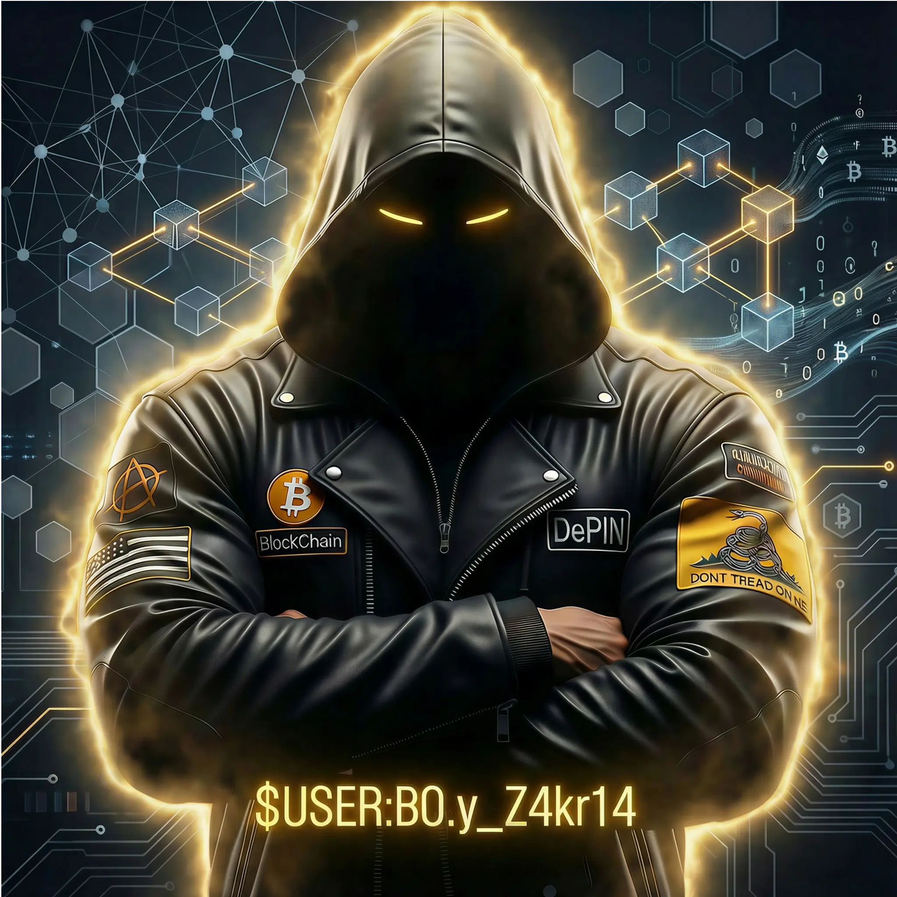

# CRMTSiAPP

CRM WhatsApp profissional, seguro, acessível e auto-hospedado sobre PostgreSQL puro (sem Supabase), otimizado para operações de atendimento em larga escala com paridade de UX e robustez corporativa.

## 🚀 Arquitetura e Recursos

- **Persistência Confiável:** PostgreSQL 17 puro com migrações idempotentes e isolamento por esquema.
- **Segurança de Borda & RBAC:** Autenticação baseada em sessões com proteção CSRF rigorosa, rate-limiting por IP e controle de acesso baseado em papéis (Viewer, Agent, Manager, Admin).
- **Processamento Durável:** Outbox transacional com lease `SKIP LOCKED` e workers em background para entregas em lote e webhooks assinados.
- **Integração WhatsApp:** Suporte a provedores WAHA (QR Code / Sessões) e API Oficial Cloud (Meta), com proteção de janela de atendimento de 24 horas e recuperação via templates aprovados.

## — Licença e Filosofia

  
  
<strong>CRMTSiAPP</strong> é mantido por <strong>B0.y_Z4kr14</strong> · TSi Telecom

